## Assumption paramters

## Merkle Tree

```mermaid
graph TB

A(1957502675450735006995294171749393708380816510550016513572325377928709312799)
B(9438425462009327938113632977103012024864684806479150699875830550507114947861)
C(17318907088932163993936474574301200048277266577227880388615604770703611868473)
D(298403764318384535391080516430271416328384684759174479700768661756576886841)
E(1036650162605266689155569618988935551591700558940979379371025402092498979322)
F(574638457005259185998031631942469350070264178173448628390443390863409788906)
G(7448170595353527003863672443603688873547380028794982484418939571913494408099)
H(936107041880948892627387585343503772163411492212883657371352110448043907916)
I(19690291642042494239924132103815711450334047642868793290286571338144171123023)
J(17655239229322083820232532186697763406298275446239639267730473604556012682950)
K(21327735939661307440800272037408205556275099435297611196870074079183395690176)
L(17335417660864987354678670922850205919151640126204131061303827322575941656848)
M(2402940869403404244864558063085056800950375796069312073883409745963248554662)
N(12871884485430907466493029987701833346078251761744937672765509143535891807609)
O(3925193791967034329860766097738798776908475099659776634683788965881451539189)

A-->B
A-->C
B-->D
B-->E
C-->F
C-->G
D-->H
D-->I
E-->J
E-->K
F-->L
F-->M
G-->N
G-->O
```



## Deploy Remix

["contract address"]
"1957502675450735006995294171749393708380816510550016513572325377928709312799"
"222222"
["10209775308811493123219977751870536028325781179662633829382233991134085591271", "10463201402378381645770001492167936758751449996873528340577630879574526767592"]
["user01", "user02", "user03"]
["cid01", "cid02", "cid03"]
60
[shareholder address, ...., ....]

## Vote

["0x3006c35464dfd705b2361d972169580d9928d0bce46c0ecd78ae4b5bf0d157ae", "0x2d420d4823847e32e137027d6bc3c3e2b705624d627f42342c3a090a5fd6a0f8"],[["0x1ec6d0521c32aa4030b04ad73714163b2d8704d7a71c68497ce97033cc9f1953", "0x2807d09ae642bfc45f61a34cad7012d2de0020fc2270828199e2df9e4d5a6fb8"],["0x1a507c090e3fc96723a8d1861fe13ee29edda7f7e975f682b2f7e2f743d871e3", "0x1c2e585acdc4abc7b6c1f7aaf38b17d9b418ba5b0cc189a82c1fcde7be918636"]],["0x2deac4317f6dfb55f6485d551f5ad078f75c7e713220b11a5fa8d679f81eaf84", "0x16c081fbbb7562ab2806252634a86760f88db2c0935e91276debcd360f1964ef"],["0x11429025de011dbd5c7319ea9fb3219431f98ea451a63d4963ec11fb2e7af5af","0x146344400a75e276d444c4d7a6ead9f92e5b13f07abb5cc41636c3737ff5c7a6","0x2fed0aef4a362c8f1d11848374cdc528fb69cf41f43546cb1f5d3d7188e483ec","0x0f131a1496a7b397ac01dd7f108bc521c705e899ca2e9867c864cc8cbf962d9a","0x02b0f6a720483f658cd2ae25d85b1813608f3e21c86f20e5e7f808e0cab68b69","0x2794db2bcf699491e9ecd9a8b2423372144cfd8fbce5e05b3f51c82cbd3791dc","0x24447da53572c2cc47a85fcef15be5efb1762299a4c06fca56efe5cddf6401ce","0x05b8073dc06ea37abf8ef401383b4c94d4e8151065f5aa605bbaf4b744292c47","0x1b6b02986fcbb2b7442277c1ee0c945e0cf97a779f294c8e3cf6c7fcbcb3c4c4","0x2a468d25644ea75b12862ce3a5d58e21bcaab6aa9f28fb8b18e5df9242f8381b","0x16430da98e2771892fa1b6e3a32cd07b4baca29932838861a89d0e0ec28b9b67","0x159f253d36d1e83f2c697d0e014e6376d563cce8bba35f7e2c7787f27d0dded9","0x2ee71fc27b1ff31b247bdbcc62e284069a07512b2c85e391deeb2f906b847f57","0x000000000000000000000000000000000000000000000000000000000003640e","0x0453e841a33f9e6687bd32c38fc71a23a9cf5ed25883153f85d1606db488911f","0x1692872db9ce21c69a9a78f488fdd8eb0ccd90c5a1928ed9329f9a37d81b30e7","0x1721f64df9d0173930bd0ef515dc0963285f763d835411c2592bf403949bb1e8"]

["0x273235a4b714e57c3d84e34ca01b76ed20e6b323ddbf23143219b262994e1d5e", "0x0cf67295e8c7e594a7f67e160ba581a5167e2288a2156d942417d2e365e40d3d"],[["0x27ba3841aef3861c2f3b9845f65dc9a0aba2eb264c9eb960fed30d91e15f590f", "0x1886625cb9fac6c7d033d553ae0e16d8df41d243f99c84a928006cbede8321df"],["0x0cced2149450c7713dbaccec2eb006365a8f88d3ca7794efad95ffbcd06f9506", "0x1534ecbaf43270ad076287a3751559a836180ed8dae71b346c101a6e794023b0"]],["0x2f5b7d3babbde2be6a9743ce3ce66027a97271e8ccc945ddb694c641a62acf50", "0x2b01c18ed4148fe29e9ac8b63f9bf00c8bbebf8aab916b27464f539d1ca695cb"],["0x004334600f1d0768ad97021813b56a1e2a882e744b89c5aa2a7d9e06f6be6871","0x146344400a75e276d444c4d7a6ead9f92e5b13f07abb5cc41636c3737ff5c7a6","0x2fed0aef4a362c8f1d11848374cdc528fb69cf41f43546cb1f5d3d7188e483ec","0x0f131a1496a7b397ac01dd7f108bc521c705e899ca2e9867c864cc8cbf962d9a","0x02b0f6a720483f658cd2ae25d85b1813608f3e21c86f20e5e7f808e0cab68b69","0x2794db2bcf699491e9ecd9a8b2423372144cfd8fbce5e05b3f51c82cbd3791dc","0x24447da53572c2cc47a85fcef15be5efb1762299a4c06fca56efe5cddf6401ce","0x05b8073dc06ea37abf8ef401383b4c94d4e8151065f5aa605bbaf4b744292c47","0x1b6b02986fcbb2b7442277c1ee0c945e0cf97a779f294c8e3cf6c7fcbcb3c4c4","0x2a468d25644ea75b12862ce3a5d58e21bcaab6aa9f28fb8b18e5df9242f8381b","0x16430da98e2771892fa1b6e3a32cd07b4baca29932838861a89d0e0ec28b9b67","0x159f253d36d1e83f2c697d0e014e6376d563cce8bba35f7e2c7787f27d0dded9","0x2ee71fc27b1ff31b247bdbcc62e284069a07512b2c85e391deeb2f906b847f57","0x000000000000000000000000000000000000000000000000000000000003640e","0x0453e841a33f9e6687bd32c38fc71a23a9cf5ed25883153f85d1606db488911f","0x1692872db9ce21c69a9a78f488fdd8eb0ccd90c5a1928ed9329f9a37d81b30e7","0x1721f64df9d0173930bd0ef515dc0963285f763d835411c2592bf403949bb1e8"]

=============

[[27535335054370038554636649451473359274210629982369448685230477258492786435106,
113339619396775446986629934741395005641945547593108742406559858586408926842116],[83346636220044339097206752303697630878633576025822579262399028153037068890112, 71468874161282436164838864310491507217097629726985693819158289720737436820999],[101054524069235788539744312381189062658026648510820283284794726203590971637786, 115689537478629378119064514001406863580323551520906922655828178084975647344917]]

[[48643227341317317151769418243604365631212514212800304519533146712906103047440, 114680528558039944950340909884397361672384708824656067432612910222788224835329],[4760241805395045073791427292533106691846638093470637032414781477253978581772, 51327392863741632619406235068199209470873931082795593149452279778118158882350], [96312030795688187355523363821333001907948222489614540613571685576816783933203, 70165749963454733259273830424359064835413412575269753584208507764318276342538]]

[[20023737955706518376707994287761862382868550049406813447657794173753340099883, 33147460391106186408989301640691083699575089891562240973362478072936729315116], [85129734734968348823688733829798400639484325675161884212037378950330981604384, 88384884760307703312077115130680600510837914258260453478054305344810750056453],[52267653422925515665461899039117923365635391450151149375411619540362236578830, 10445588710524074645154331171053404563880462387410370347327791822947189213973]]

=======

[[83346636220044339097206752303697630878633576025822579262399028153037068890112, 71468874161282436164838864310491507217097629726985693819158289720737436820999],[90927960449018489048544008981984980546317636447277949695528824709469706605850, 9871408179465612407071652136371752829361540585255800299118906393191668776475],[28913765173422245076571850016407053155635152722734055714681548824967851531276, 67158211714612289177534980386252138490482348316576813535139163945877029417221]]

[[4760241805395045073791427292533106691846638093470637032414781477253978581772, 51327392863741632619406235068199209470873931082795593149452279778118158882350], [29395924926702815036578689644578323322337960605737686722342063441167429744393, 111444789680836238801885051913141896190993401378949361995916033544211045268745],[15243611494142278768173582505934579668565471097286025117065091010046137224712,  106268642989609089296920541551787623754616411764346648926792882629208222875422]]

[[85129734734968348823688733829798400639484325675161884212037378950330981604384, 88384884760307703312077115130680600510837914258260453478054305344810750056453],[11500915216256569996340835239876597592906599218859137544143366350089047064601, 50186497347060599071096523452024787366939196895606717600922570965457560504604],[67849056858582236502310923319208355181121785401147613576821444469451301239070, 103713363577186469888651487998658411816133351464040805025282438696199457942054]]

### Key

```skTotal:
mastersk: 1097094918319998294314187
pkX: 10209775308811493123219977751870536028325781179662633829382233991134085591271
pkY: 10463201402378381645770001492167936758751449996873528340577630879574526767592
gX: 5299619240641551281634865583518297030282874472190772894086521144482721001553
gY: 16950150798460657717958625567821834550301663161624707787222815936182638968203
share01: 753157357358364583671740906940785287168097948972083172693743990542486426066n
share02: 2609610238645162480387581564549985907723206405831756841228492903352011377847n
share03: 97297925900574884585920536513283089511697426261887584298733736529974423448n
share04: 1424311496064330004609159977302154990764012926738177179505113472921717681992n
share05: 1118590231176609034895698450602282839326524962943491108447200790630346407397n
```
